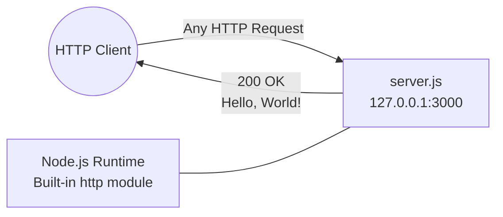
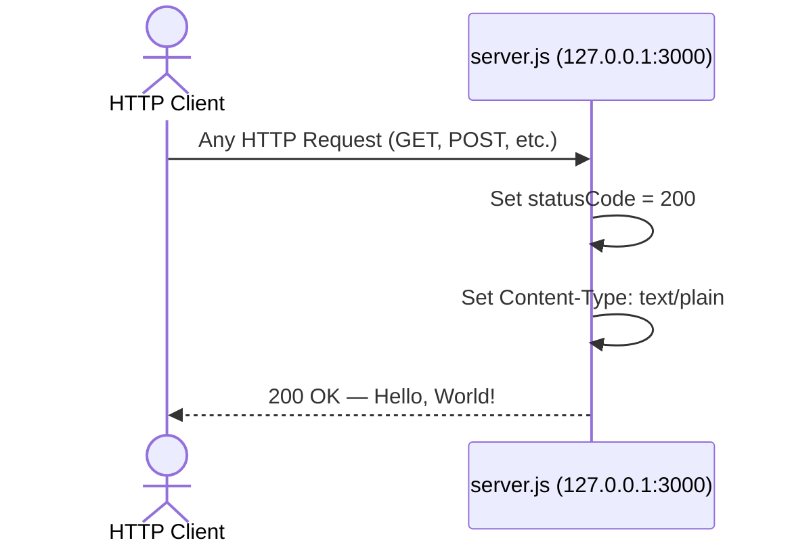

# hao-backprop-test

A minimal, zero-dependency Node.js HTTP server that responds with "Hello, World!" to all incoming requests. Originally created as a Backprop integration test harness.

> **Project Context:** This repository serves as a [Backprop](https://backprop.dev) integration test fixture. The server is intentionally minimal — a single-file, zero-dependency HTTP server — to provide a stable, predictable target for integration testing workflows.

| Metadata | Value | Source |
|---|---|---|
| Package Name | `hello_world` | `package.json:2` |
| Version | `1.0.0` | `package.json:3` |
| Author | `hxu` | `package.json:9` |
| License | MIT | `package.json:10` |
| Entry Point | `server.js` | `server.js:12-57` |

### Architecture Overview



The server uses only the Node.js built-in [`http`](https://nodejs.org/api/http.html) module — no frameworks, no middleware, no external packages. Every incoming HTTP request receives an identical `200 OK` response with the plain-text body `Hello, World!`. *(Source: `server.js:12-57`, `package.json:2-5`)*

---

## Prerequisites

Before running the server, ensure the following tools are installed:

- **[Node.js](https://nodejs.org/)** — LTS version recommended:
  - Node.js 20.x (Iron) — Maintenance LTS
  - Node.js 22.x (Jod) — Maintenance LTS
  - Node.js 24.x (Krypton) — Active LTS
- **npm** — Version 7 or later (ships with Node.js LTS). The project's `package-lock.json` uses `lockfileVersion: 3`, which requires npm 7+. *(Source: `package-lock.json:4`)*

Verify your installation:

```bash
node --version
# Expected output: v20.x.x, v22.x.x, or v24.x.x

npm --version
# Expected output: 7.x.x or later
```

---

## Installation

```bash
# Clone the repository
git clone <repository-url> hao-backprop-test

# Navigate into the project directory
cd hao-backprop-test

# Install dependencies
npm install
```

> **Note:** This project has **zero external dependencies**. The `npm install` command resolves only the root package itself — there are no `dependencies` or `devDependencies` entries in `package.json`. The `package-lock.json` confirms the dependency tree contains only the root package. *(Source: `package.json:1-11`, `package-lock.json:6-11`)*

---

## Quick Start

**1. Start the server:**

```bash
node server.js
```

**2. Observe the startup message:**

```
Server running at http://127.0.0.1:3000/
```

*(Source: `server.js:56` — the startup callback logs this message via `console.log`)*

**3. Verify the server is responding:**

```bash
curl http://127.0.0.1:3000
```

**Expected output:**

```
Hello, World!
```

**4. Stop the server:**

Press `Ctrl+C` (sends SIGINT) to terminate the server process.

> **Entry Point Note:** The `package.json` declares `"main": "index.js"` *(Source: `package.json:5`)*, but the actual server entry point is `server.js`. This means `node .` will **not** work — always use `node server.js` explicitly to start the server.

---

## API Documentation

### Endpoint

The server exposes a single endpoint at:

```
http://127.0.0.1:3000/
```

### Request Handling

**All HTTP methods are accepted.** The server has no routing logic — the request handler processes every incoming request identically, regardless of the HTTP method, URL path, query parameters, or request headers. *(Source: `server.js:41-45`)*

### Response Details

| Property | Value | Source |
|---|---|---|
| Status Code | `200 OK` | `server.js:42` |
| Content-Type | `text/plain` | `server.js:43` |
| Body | `Hello, World!\n` | `server.js:44` |

### Example Request and Response

**Request with full response headers:**

```bash
curl -i http://127.0.0.1:3000
```

**Expected output:**

```http
HTTP/1.1 200 OK
Content-Type: text/plain
Date: <current-date>
Connection: keep-alive
Keep-Alive: timeout=5
Content-Length: 14

Hello, World!
```

### Request-Response Lifecycle



---

## Code Walkthrough

The entire server is contained in a single file, `server.js` (57 lines including JSDoc annotations). This section explains each part of the executable code. The source file includes [JSDoc](https://jsdoc.app/) annotations for IDE IntelliSense support.

### 1. Module Import (Line 12)

```javascript
const http = require('http');
```

Imports the Node.js built-in [`http`](https://nodejs.org/api/http.html) module using the CommonJS `require()` syntax. This module provides the `http.createServer()` factory method used to create the server instance. No external packages are imported — the entire server runs on Node.js built-in functionality. *(Source: `server.js:12`)*

### 2. Configuration Constants (Lines 20 and 26)

```javascript
const hostname = '127.0.0.1';
const port = 3000;
```

Defines the two configuration constants that control where the server listens for connections:

| Constant | Type | Value | Description | Source |
|---|---|---|---|---|
| `hostname` | `string` | `'127.0.0.1'` | The IP address the server binds to. `127.0.0.1` restricts connections to the local machine (localhost). | `server.js:20` |
| `port` | `number` | `3000` | The TCP port the server listens on. Port 3000 is a conventional choice for Node.js development servers. | `server.js:26` |

### 3. Server Creation and Request Handler (Lines 41–45)

```javascript
const server = http.createServer((req, res) => {
  res.statusCode = 200;
  res.setHeader('Content-Type', 'text/plain');
  res.end('Hello, World!\n');
});
```

Creates an HTTP server instance using `http.createServer()` and assigns it to the `server` constant. The factory method accepts a request handler callback that is invoked for every incoming HTTP request:

- **`req`** (`http.IncomingMessage`) — The incoming request object containing the HTTP method, URL, headers, and body stream. This parameter is available but unused in this handler since all requests receive the same response.
- **`res`** (`http.ServerResponse`) — The server response object used to construct and send the HTTP response back to the client.

The request handler performs three operations in sequence:
1. Sets the response status code to `200` (OK) *(Source: `server.js:42`)*
2. Sets the `Content-Type` response header to `text/plain` *(Source: `server.js:43`)*
3. Sends the response body `Hello, World!\n` and signals the end of the response *(Source: `server.js:44`)*

### 4. Server Startup (Lines 55–57)

```javascript
server.listen(port, hostname, () => {
  console.log(`Server running at http://${hostname}:${port}/`);
});
```

Binds the server to the configured `hostname` and `port`, then invokes the startup callback once the server is ready to accept connections. The callback logs the server's URL to the console, producing the output: `Server running at http://127.0.0.1:3000/`. *(Source: `server.js:55-57`)*

---

## Deployment Guide

### Local Development

For local development, start the server directly with Node.js:

```bash
node server.js
```

The server will be accessible at `http://127.0.0.1:3000/`. *(Source: `server.js:20,26`, `server.js:55-57`)*

### Hostname Binding

The server is configured to bind to `127.0.0.1` (localhost only). *(Source: `server.js:20`)*

This means the server **only accepts connections from the local machine**. To accept connections from other machines on the network, modify the `hostname` constant in `server.js`:

```javascript
// Accept connections from any network interface
const hostname = '0.0.0.0';
```

> **Security Warning:** Binding to `0.0.0.0` exposes the server to all network interfaces, including public-facing ones. Only do this in trusted network environments or behind a reverse proxy with appropriate firewall rules.

### Port Configuration

The server listens on port `3000` by default. *(Source: `server.js:26`)*

To use a different port, modify the `port` constant in `server.js`:

```javascript
const port = 8080; // Changed from 3000
```

Common port considerations:
- Ports below `1024` require elevated privileges (root/sudo) on most systems
- Port `0` lets the OS assign a random available port
- Ensure the chosen port is not already in use by another process

### Process Management

For long-running deployments, use a process manager to keep the server running and restart it on failure:

**Using PM2:**

```bash
# Install PM2 globally
npm install -g pm2

# Start the server with PM2
pm2 start server.js --name hao-backprop-test

# View running processes
pm2 list

# View server logs
pm2 logs hao-backprop-test

# Stop the server
pm2 stop hao-backprop-test
```

**Using systemd (Linux):**

Create a service file at `/etc/systemd/system/hao-backprop-test.service`:

```ini
[Unit]
Description=hao-backprop-test HTTP Server
After=network.target

[Service]
Type=simple
User=www-data
WorkingDirectory=/path/to/hao-backprop-test
ExecStart=/usr/bin/node server.js
Restart=on-failure

[Install]
WantedBy=multi-user.target
```

Then enable and start the service:

```bash
sudo systemctl enable hao-backprop-test
sudo systemctl start hao-backprop-test
```

### Production Considerations

> **Note:** This project is designed as a Backprop integration test fixture, not a production web server. If adapting for production use, consider the following:

- **Reverse Proxy** — Place nginx or similar in front of Node.js to handle TLS termination, load balancing, and static asset serving
- **HTTPS Termination** — The server uses plain HTTP; configure TLS at the reverse proxy layer
- **Process Monitoring** — Use PM2, systemd, or a container orchestrator to ensure automatic restarts
- **Logging** — Implement structured logging (e.g., with `pino` or `winston`) beyond the single startup `console.log`
- **Environment Variables** — Externalize `hostname` and `port` using `process.env` instead of hardcoded constants

---

## Project Structure

The repository has a flat structure with no subdirectories:

```
hao-backprop-test/
├── server.js
├── package.json
├── package-lock.json
└── README.md
```

| File | Purpose |
|---|---|
| `server.js` | HTTP server entry point — creates and starts the server (57 lines including JSDoc annotations) |
| `package.json` | npm project manifest — declares metadata, scripts, and license |
| `package-lock.json` | npm lockfile — ensures deterministic installs (lockfileVersion 3) |
| `README.md` | Project documentation (this file) |

> **Entry Point Mismatch:** The `package.json` declares `"main": "index.js"` *(Source: `package.json:5`)*, but no `index.js` file exists. The actual server entry point is `server.js`. This discrepancy does not affect server operation (since the server is started directly with `node server.js`), but it means `require('hello_world')` or `node .` would fail with a `MODULE_NOT_FOUND` error.

---

## Troubleshooting

### EADDRINUSE — Port Already in Use

**Error message:**

```
Error: listen EADDRINUSE: address already in use 127.0.0.1:3000
```

**Cause:** Another process is already using port 3000.

**Solution:**

```bash
# Find the process using port 3000
lsof -i :3000
# or on Linux:
ss -tlnp | grep 3000

# Kill the process (replace <PID> with the actual process ID)
kill <PID>

# Or change the port in server.js:26 to an available port
```

*(Source: `server.js:26` — the port constant that determines which port to bind)*

### Wrong Node.js Version

**Symptoms:** Unexpected syntax errors, missing built-in module features, or runtime crashes.

**Diagnosis:**

```bash
node --version
```

**Solution:** The server requires Node.js 12.0.0 or later (for ES6 template literal and arrow function support). Node.js 20.x LTS or later is recommended. Download the latest LTS version from [nodejs.org](https://nodejs.org/).

### MODULE_NOT_FOUND

**Error message:**

```
Error: Cannot find module '/path/to/server.js'
```

**Cause:** The `node server.js` command was executed from the wrong directory, or the file does not exist at the expected path.

**Solution:**

```bash
# Verify you are in the correct project directory
pwd
ls -la server.js

# If server.js is not listed, navigate to the project root
cd /path/to/hao-backprop-test

# Retry
node server.js
```

> **Note:** Running `node .` or `node index.js` will also produce a `MODULE_NOT_FOUND` error because `package.json` declares `"main": "index.js"` but no `index.js` file exists. Always use `node server.js` explicitly. *(Source: `package.json:5`)*

---

## License

This project is licensed under the **MIT License**. *(Source: `package.json:10`)*

Author: **hxu** *(Source: `package.json:9`)*
