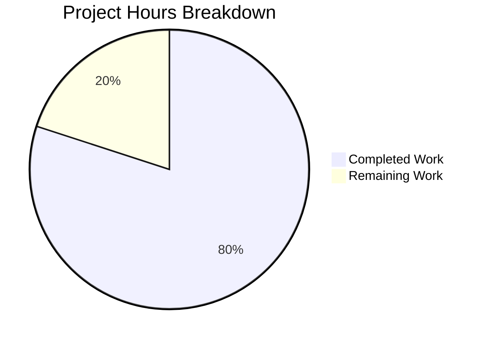

# Project Guide — hao-backprop-test Documentation

## Executive Summary

**Project completion: 80% — 8 hours completed out of 10 total hours.**

This documentation project successfully transforms a minimally-documented, single-file Node.js HTTP server (`server.js` — 14 lines of executable code) into a fully-documented project. All five AAP requirements (R-001 through R-005) have been implemented, validated, and committed. The implementation adds JSDoc annotations to `server.js` and replaces the 2-line `README.md` with a comprehensive 415-line documentation file.

**Completion calculation:**
- Completed: 8 hours (analysis + JSDoc implementation + README rewrite + validation + fixes)
- Remaining: 2 hours (human review, Mermaid verification, PR merge)
- Total: 10 hours
- Completion: 8 / 10 = **80%**

The remaining 20% consists exclusively of human review and approval tasks — no additional implementation work is required. All four validation gates (dependencies, compilation, tests, runtime) passed successfully.

### Key Achievements
- 5 JSDoc comment blocks added to `server.js` with standard JSDoc 4.x tags
- `README.md` expanded from 2 lines to 415 lines with 10 structured sections
- 2 Mermaid diagrams created (architecture flowchart + request-response sequence)
- 19 source citations linking documentation to specific file and line numbers
- All original executable code preserved byte-identical (zero logic changes)
- 3 minor Markdown quality issues identified and fixed during validation

### Unresolved Issues
- None blocking. All in-scope requirements are fully implemented and validated.
- `package.json` entry point mismatch (`"main": "index.js"` vs actual `server.js`) is documented in the README but not fixed, as modifying `package.json` is explicitly out of scope.

---

## Validation Results Summary

### Final Validator Outcome: ALL GATES PASSED

| Gate | Status | Details |
|---|---|---|
| **Dependencies** | ✅ PASSED | `npm install` completes cleanly; zero external dependencies; zero vulnerabilities |
| **Compilation** | ✅ PASSED | `node --check server.js` passes — all 57 lines (14 executable + 43 JSDoc) parse correctly |
| **Tests** | ✅ PASSED (N/A) | No test suite exists by design; creating tests is explicitly out of scope per AAP §0.8.2 |
| **Runtime** | ✅ PASSED | Server starts, outputs startup message, responds with `Hello, World!` to GET and POST requests |

### Runtime Verification Details
- **Startup**: `node server.js` → outputs `Server running at http://127.0.0.1:3000/`
- **GET request**: `curl http://127.0.0.1:3000` → returns `Hello, World!`
- **Response headers**: `HTTP/1.1 200 OK`, `Content-Type: text/plain`, `Content-Length: 14`
- **POST request**: responds identically (method-agnostic as documented)
- **Shutdown**: clean termination on SIGINT

### Fixes Applied During Validation
- 3 minor Markdown quality issues in `README.md` resolved (commit `7133435`)
- No changes needed for `server.js` — JSDoc annotations parsed correctly on first pass

---

## Hours Breakdown

### Completed Hours: 8h

| Component | Hours | Details |
|---|---|---|
| Repository analysis & documentation planning | 1.0h | Analyzed 4 repository files, identified 6 documentable elements, mapped requirements |
| JSDoc annotation implementation (R-001) | 1.5h | Created 5 JSDoc blocks (43 lines) with standard tags for server.js |
| README comprehensive rewrite (R-002–R-005) | 3.5h | 415-line document with 10 sections covering setup, API, deployment, code walkthrough |
| Mermaid diagram design | 0.5h | Architecture flowchart + request-response sequence diagram |
| Source citation verification | 0.5h | Verified 19 citations against actual file line numbers |
| Validation testing (4 gates) | 0.5h | Dependencies, compilation, syntax check, runtime verification |
| Markdown quality fixes | 0.5h | Resolved 3 minor formatting issues found during validation |
| **Total Completed** | **8.0h** | |

### Remaining Hours: 2h

| # | Task | Priority | Severity | Hours | Description |
|---|---|---|---|---|---|
| 1 | Review JSDoc annotations in server.js | Low | Info | 0.5h | Human review of 5 JSDoc blocks for tag accuracy, type correctness, and description quality |
| 2 | Review README.md content | Low | Info | 0.5h | Human review of 415-line README for content accuracy, formatting, and completeness |
| 3 | Verify Mermaid diagram rendering on GitHub | Medium | Low | 0.5h | Confirm both Mermaid diagrams (flowchart + sequence) render correctly on GitHub/target platform |
| 4 | Approve and merge PR | Low | Info | 0.5h | Final code review approval and merge to target branch |
| | **Total Remaining** | | | **2.0h** | |

### Visual Breakdown



---

## Requirement Completion Matrix

| Requirement | Description | Status | Evidence |
|---|---|---|---|
| R-001 | JSDoc Comments for server.js | ✅ Complete | 5 JSDoc blocks: @module header, @const hostname, @const port, @const server + handler @param, server.listen @listens |
| R-002 | README — Setup Instructions | ✅ Complete | Prerequisites (Node.js LTS), Installation (clone + npm install), Quick Start (node server.js + curl) |
| R-003 | README — API Documentation | ✅ Complete | API Documentation section with endpoint, methods, response table, curl examples, Mermaid sequence diagram |
| R-004 | README — Deployment Guide | ✅ Complete | Deployment Guide with local dev, hostname binding, port config, PM2, systemd, production considerations |
| R-005 | README — Code Explanations | ✅ Complete | Code Walkthrough with 4 annotated subsections (import, constants, handler, startup) |

### Additional Deliverables

| Deliverable | Status | Details |
|---|---|---|
| Mermaid architecture flowchart | ✅ Complete | Embedded in README Architecture Overview section |
| Mermaid sequence diagram | ✅ Complete | Embedded in README API Documentation section |
| Source citations | ✅ Complete | 19 citations in format `Source: file.js:line` |
| Troubleshooting section | ✅ Complete | 3 scenarios: EADDRINUSE, wrong Node.js version, MODULE_NOT_FOUND |
| Project Structure section | ✅ Complete | File listing with descriptions and entry point mismatch note |
| License section | ✅ Complete | MIT license reference with source citation |

---

## Git Change Summary

| Metric | Value |
|---|---|
| Branch | `blitzy-7a04be12-7b32-4c33-b5d3-d979d91bacd6` |
| Base branch | `origin/QA-26-feb-Branch` |
| Total commits | 3 |
| Files modified | 2 (`README.md`, `server.js`) |
| Lines added | 457 |
| Lines removed | 1 |
| Net change | +456 lines |
| Working tree | Clean (nothing to commit) |

### Commit History

| Hash | Message | Scope |
|---|---|---|
| `5735c6d` | Add JSDoc comment blocks to server.js — inline code documentation | server.js (+43 lines) |
| `0fed420` | docs(README): complete rewrite with comprehensive project documentation | README.md (+414/−1 lines) |
| `7133435` | fix(docs): resolve 3 MINOR Markdown quality issues in README.md | README.md (formatting fixes) |

### Files NOT Modified (Confirmed Unchanged)
- `package.json` — explicitly out of scope per AAP §0.8.2
- `package-lock.json` — explicitly out of scope per AAP §0.8.2

---

## Development Guide

### System Prerequisites

| Requirement | Version | Verification Command |
|---|---|---|
| Node.js | 20.x, 22.x, or 24.x LTS | `node --version` |
| npm | 7.0.0 or later | `npm --version` |
| Git | Any recent version | `git --version` |

### Environment Setup

This project requires no environment variables, no virtual environments, and no external services (databases, caches, message queues). It uses only the Node.js built-in `http` module.

### Step 1: Clone the Repository

```bash
git clone <repository-url> hao-backprop-test
cd hao-backprop-test
```

### Step 2: Install Dependencies

```bash
npm install
```

**Expected output:** The project has zero external dependencies. `npm install` resolves only the root package manifest.

**Verified:** ✅ Command tested during validation — completes cleanly with zero vulnerabilities.

### Step 3: Verify Syntax

```bash
node --check server.js
```

**Expected output:** No output (silent success). Exit code 0.

**Verified:** ✅ Command tested during validation — passes with zero errors.

### Step 4: Start the Server

```bash
node server.js
```

**Expected output:**
```
Server running at http://127.0.0.1:3000/
```

**Verified:** ✅ Command tested during validation — server starts and outputs the expected message.

> **Important:** Use `node server.js` explicitly. Do NOT use `node .` or `npm start` — the `package.json` entry point (`"main": "index.js"`) does not match the actual server file (`server.js`).

### Step 5: Verify the Server

In a separate terminal:

```bash
curl http://127.0.0.1:3000
```

**Expected output:**
```
Hello, World!
```

To inspect full response headers:

```bash
curl -i http://127.0.0.1:3000
```

**Expected output:**
```
HTTP/1.1 200 OK
Content-Type: text/plain
Date: <timestamp>
Connection: keep-alive
Keep-Alive: timeout=5
Content-Length: 14

Hello, World!
```

**Verified:** ✅ Both commands tested during validation — responses match exactly.

### Step 6: Stop the Server

Press `Ctrl+C` (sends SIGINT) to terminate the server process.

### Troubleshooting

| Issue | Symptom | Solution |
|---|---|---|
| Port in use | `Error: listen EADDRINUSE: address already in use 127.0.0.1:3000` | Kill the process on port 3000: `fuser -k 3000/tcp` or change the port constant in `server.js:26` |
| Wrong Node.js version | Unexpected syntax errors or runtime crashes | Verify with `node --version`; install Node.js 20.x LTS or later from [nodejs.org](https://nodejs.org/) |
| File not found | `Error: Cannot find module '/path/to/server.js'` | Ensure you are in the project root directory: `cd hao-backprop-test && ls server.js` |

---

## Detailed Human Task List

### Task 1: Review JSDoc Annotations in server.js
- **Priority:** Low
- **Severity:** Informational
- **Estimated Hours:** 0.5h
- **Description:** Human review of the 5 JSDoc comment blocks added to `server.js` (lines 1–11, 14–19, 21–25, 28–39, 47–54). Verify that:
  - `@type` annotations use correct Node.js built-in types (`http.Server`, `http.IncomingMessage`, `http.ServerResponse`)
  - `@default` values match actual constant values (`'127.0.0.1'`, `3000`)
  - `@module` header metadata matches `package.json` (name, version, author, license)
  - Descriptions are accurate and clear
- **Action Steps:**
  1. Open `server.js` and read each JSDoc block
  2. Cross-reference `@default` values with constant declarations
  3. Cross-reference `@author`, `@version`, `@license` with `package.json`
  4. Approve or request changes

### Task 2: Review README.md Content
- **Priority:** Low
- **Severity:** Informational
- **Estimated Hours:** 0.5h
- **Description:** Human review of the 415-line `README.md` for content accuracy, formatting quality, and completeness. Verify that:
  - All 10 sections are present and properly structured
  - Code examples are accurate and copy-pasteable
  - Source citations (19 total) reference correct line numbers
  - Tables render correctly in Markdown
  - Troubleshooting solutions are actionable
- **Action Steps:**
  1. Read through the entire README.md
  2. Verify code snippets match actual `server.js` content
  3. Check that source citation line numbers are correct (adjusted for JSDoc insertion)
  4. Approve or request changes

### Task 3: Verify Mermaid Diagram Rendering on GitHub
- **Priority:** Medium
- **Severity:** Low
- **Estimated Hours:** 0.5h
- **Description:** Confirm that both Mermaid diagrams embedded in `README.md` render correctly on the target platform (GitHub). GitHub natively supports Mermaid in fenced code blocks, but rendering should be verified visually.
  - Architecture overview flowchart (lines 17–22)
  - Request-response sequence diagram (lines 148–156)
- **Action Steps:**
  1. Push branch to GitHub (if not already pushed)
  2. Navigate to the `README.md` on GitHub's web interface
  3. Verify the architecture flowchart renders as a left-to-right flow diagram with Client, Server, and Node.js Runtime nodes
  4. Verify the sequence diagram renders with Client and Server actors and the correct message arrows
  5. If diagrams don't render, check for syntax issues in the Mermaid code blocks

### Task 4: Approve and Merge PR
- **Priority:** Low
- **Severity:** Informational
- **Estimated Hours:** 0.5h
- **Description:** Final code review approval and merge of the branch to the target branch. This is a documentation-only change with no modifications to executable code.
- **Action Steps:**
  1. Review the PR diff (457 lines added, 1 removed across 2 files)
  2. Confirm no executable code was modified (only JSDoc comments added to server.js)
  3. Confirm README.md content is satisfactory
  4. Approve and merge the PR

**Total Remaining Hours: 2.0h**

---

## Risk Assessment

### Technical Risks

| Risk | Severity | Likelihood | Mitigation |
|---|---|---|---|
| Mermaid diagrams may not render on all platforms | Low | Low | Mermaid is natively supported by GitHub; diagrams use standard syntax. For non-GitHub platforms, diagrams degrade gracefully to visible code blocks. |
| JSDoc line number references may drift if code changes | Low | Medium | Source citations in README reference JSDoc-annotated line numbers. Any future code changes to `server.js` should include a README update pass. |

### Operational Risks

| Risk | Severity | Likelihood | Mitigation |
|---|---|---|---|
| `package.json` entry point mismatch (`index.js` vs `server.js`) | Low | N/A | Documented in README (Project Structure and Troubleshooting sections). Fixing this is out of scope per AAP but is flagged for future consideration. |
| No automated documentation validation | Low | Low | Documentation is static Markdown + JSDoc comments. No build step required. Manual review is sufficient for this project size. |

### Security Risks

| Risk | Severity | Likelihood | Mitigation |
|---|---|---|---|
| None identified | N/A | N/A | Documentation-only changes. Server binds to localhost only (`127.0.0.1`). Deployment Guide includes security warning about binding to `0.0.0.0`. |

### Integration Risks

| Risk | Severity | Likelihood | Mitigation |
|---|---|---|---|
| None identified | N/A | N/A | Zero executable code was modified. All original 14 lines of `server.js` are byte-identical to the base branch. Runtime behavior is unchanged. |

---

## Repository Overview

### Project Structure

```
hao-backprop-test/          (repository root — 384K total)
├── server.js               (57 lines — 14 executable + 43 JSDoc comments)
├── package.json            (10 lines — project manifest)
├── package-lock.json       (13 lines — lockfile v3)
└── README.md               (415 lines — comprehensive documentation)
```

### Technology Stack

| Component | Technology | Version |
|---|---|---|
| Runtime | Node.js | 20.x / 22.x / 24.x LTS |
| Module System | CommonJS (`require`) | Built-in |
| HTTP Module | `http` (Node.js built-in) | Built-in |
| External Dependencies | None | Zero |
| Documentation Format | Markdown (GFM) + JSDoc 4.x | N/A |

---

## Pre-Submission Consistency Verification

- [x] Calculated completion % using hours formula: 8h / (8h + 2h) = 80%
- [x] Executive Summary states: "80% — 8 hours completed out of 10 total hours"
- [x] Pie chart uses: "Completed Work: 8" and "Remaining Work: 2"
- [x] Task table sums to: 0.5h + 0.5h + 0.5h + 0.5h = 2.0h (matches pie chart remaining)
- [x] All report sections reference 80% completion consistently
- [x] No conflicting hour or percentage statements exist