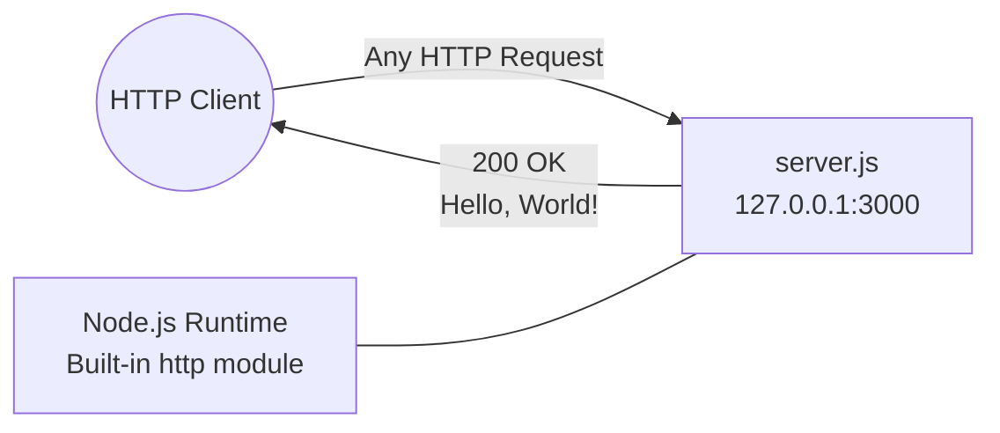
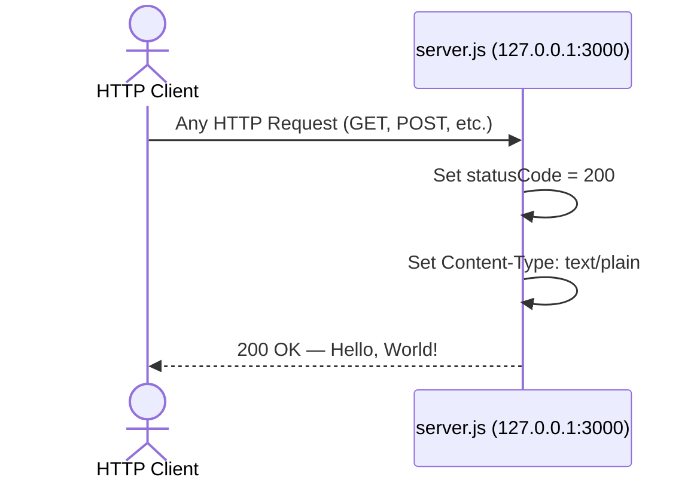

# Technical Specification

# 0. Agent Action Plan

## 0.1 Intent Clarification

### 0.1.1 Core Documentation Objective

Based on the provided requirements, the Blitzy platform understands that the documentation objective is to **transform a minimally-documented, single-file Node.js HTTP server into a fully-documented project** by adding structured inline code comments (JSDoc) to `server.js` and replacing the existing 2-line README with a comprehensive project documentation file covering setup, API reference, deployment, and code explanation.

**Request Categorization:** Create new documentation | Fix documentation gaps | Improve documentation coverage

**Documentation Type:** JSDoc inline comments | README file (setup guide, API reference, deployment guide, code walkthrough)

**Detailed Requirement Breakdown:**

- **R-001: JSDoc Comments for server.js** — Add structured JSDoc comment blocks to every documentable element in `server.js`, including module-level documentation, constants (`hostname`, `port`), the HTTP request handler callback, the `server` instance, and the `server.listen` startup callback. JSDoc annotations must include `@module`, `@description`, `@const`, `@type`, `@param`, `@callback`, and `@listens` tags as appropriate.
- **R-002: Comprehensive README — Setup Instructions** — Document the complete local development setup workflow, including Node.js runtime prerequisites, repository cloning, dependency installation (even though dependencies are zero), and server startup via `node server.js`.
- **R-003: Comprehensive README — API Documentation** — Document the HTTP server's single endpoint behavior: URL, supported methods (all — no routing), request handling, response format (`200 OK`, `text/plain`, `Hello, World!\n`), and headers.
- **R-004: Comprehensive README — Deployment Guide** — Provide a guide for running the server locally and considerations for deploying beyond localhost, including port configuration, hostname binding, and process management.
- **R-005: Comprehensive README — Inline Code Explanations** — Include a code walkthrough section in the README that explains each section of `server.js` with annotated code snippets and narrative descriptions.

**Inferred Documentation Needs:**

- Based on code analysis: `server.js` contains zero comments and zero JSDoc annotations — every public element lacks documentation
- Based on structure: The `package.json` declares `"main": "index.js"` but the actual entry point is `server.js` — this mismatch must be documented for developer clarity
- Based on dependencies: The project uses zero external packages (only Node.js built-in `http` module) — this zero-dependency posture should be explicitly documented in the README
- Based on user journey: A new developer encountering this project needs a quick-start path from `git clone` to a running server verified with `curl`

### 0.1.2 Special Instructions and Constraints

- **No explicit style directives were provided** — JSDoc comments will follow the official JSDoc 4.x annotation standard for CommonJS Node.js modules as documented at [jsdoc.app](https://jsdoc.app)
- **No templates were provided** — The README will follow standard Node.js README best practices: project title, description, prerequisites, installation, usage, API reference, deployment, code explanation, and license
- **Immutability warning**: The existing `README.md` contains a "Do not touch!" directive referencing the codebase's role as a Backprop integration test fixture. The new comprehensive README will preserve awareness of this project context while fulfilling the documentation requirements
- **Style preferences**: Technical, concise prose appropriate for a developer audience; Markdown formatting with GitHub Flavored Markdown (GFM) compatibility; Mermaid diagrams for architecture visualization

### 0.1.3 Technical Interpretation

These documentation requirements translate to the following technical documentation strategy:

- To **document server.js functions** (R-001), we will **update** `server.js` by inserting JSDoc comment blocks above every constant declaration, the `http.createServer()` callback, and the `server.listen()` callback, using standard JSDoc tags (`@module`, `@const`, `@type`, `@param`, `@callback`, `@description`, `@listens`, `@see`)
- To **create setup instructions** (R-002), we will **replace** the existing 2-line `README.md` with a comprehensive Markdown document containing a Prerequisites section (Node.js LTS), Installation section (clone + npm install), and Quick Start section (node server.js + curl verification)
- To **create API documentation** (R-003), we will **add** an API Reference section to `README.md` documenting the single HTTP endpoint at `http://127.0.0.1:3000/`, its method-agnostic behavior, response structure, status codes, and headers
- To **create a deployment guide** (R-004), we will **add** a Deployment section to `README.md` covering local execution, process management options (PM2, systemd), hostname/port configuration guidance, and production considerations
- To **create inline code explanations** (R-005), we will **add** a Code Walkthrough section to `README.md` with annotated excerpts from `server.js` explaining the module import, constant definitions, request handler logic, and server binding

## 0.2 Documentation Discovery and Analysis

### 0.2.1 Existing Documentation Infrastructure Assessment

Repository analysis reveals a **near-absent documentation infrastructure** with a single, minimal README as the only documentation artifact. No documentation tooling, generators, templates, or style guides exist in the codebase.

**Search patterns employed:**

| Search Pattern | Result |
|---|---|
| `README*` | `README.md` found — 2 lines only: title + "Do not touch!" warning |
| `docs/**` | No `docs/` directory exists |
| `*.md` (excluding README) | No additional Markdown files found |
| `*.mdx`, `*.rst`, `wiki/**` | None found |
| `mkdocs.yml`, `docusaurus.config.js`, `sphinx.conf.py` | No documentation generators configured |
| `.jsdoc.json`, `.jsdoc.conf`, `jsdoc.json` | No JSDoc configuration file exists |
| JSDoc comments in `server.js` | Zero JSDoc comment blocks; zero inline comments of any kind |
| `CONTRIBUTING.md`, `CHANGELOG.md`, `LICENSE` | None found — license declared only in `package.json` as `"MIT"` |

**Documentation findings summary:** The repository contains exactly one documentation file (`README.md`) with 2 lines of content. There are zero inline code comments, zero JSDoc annotations, zero documentation configuration files, and zero documentation build scripts. The project's documentation coverage is effectively 0%.

**Current documentation framework:** None — no documentation generator or framework is installed or configured.

| Infrastructure Element | Status | Details |
|---|---|---|
| Documentation framework | Not present | No mkdocs, docusaurus, sphinx, or JSDoc toolchain |
| Documentation generator config | Not present | No `.jsdoc.json`, `mkdocs.yml`, or equivalent |
| API documentation tools | Not present | No JSDoc, TypeDoc, or Swagger configured |
| Diagram tools | Not present | No Mermaid CLI, PlantUML, or equivalent |
| Documentation hosting/deployment | Not present | No GitHub Pages, ReadTheDocs, or equivalent |
| Inline code documentation | Not present | `server.js` contains zero comments |

### 0.2.2 Repository Code Analysis for Documentation

**Search patterns used for code to document:**

| Pattern | Target | Result |
|---|---|---|
| Module-level exports | `server.js` — no explicit `module.exports` | Server runs as standalone; not imported as module |
| Public API surface | `server.js` lines 6–10 — HTTP request handler | Single handler returning static response |
| Constants/Configuration | `server.js` lines 3–4 — `hostname`, `port` | Hardcoded values: `'127.0.0.1'`, `3000` |
| Entry point | `server.js` line 1 — `require('http')` | CommonJS import of built-in module |
| Server binding | `server.js` lines 12–14 — `server.listen()` | Localhost binding with startup log |

**Key directories examined:**

- `/` (repository root) — flat structure, no subdirectories. All 4 files reside at root level.

**Related documentation found:**

- `README.md` — Contains only project title (`# hao-backprop-test`) and the directive `test project for backprop integration. Do not touch!`. This provides context about the project's purpose but no technical documentation.
- `package.json` — Contains metadata: package name (`hello_world`), version (`1.0.0`), description (`Hello world in Node.js`), author (`hxu`), license (`MIT`). This metadata will be referenced in the new README.

**Documentable elements identified in `server.js`:**

| Line(s) | Element | Type | JSDoc Tags Needed |
|---|---|---|---|
| 1 | `const http = require('http')` | Module import | `@module`, `@requires` |
| 3 | `const hostname = '127.0.0.1'` | Configuration constant | `@const`, `@type {string}` |
| 4 | `const port = 3000` | Configuration constant | `@const`, `@type {number}` |
| 6–10 | `(req, res) => {...}` | Request handler callback | `@callback`, `@param`, `@description` |
| 6 | `const server = http.createServer(...)` | Server instance | `@const`, `@type {http.Server}` |
| 12–14 | `server.listen(port, hostname, () => {...})` | Server startup with callback | `@listens`, `@description` |

### 0.2.3 Web Search Research Conducted

- **JSDoc best practices for Node.js HTTP servers**: Confirmed that JSDoc 4.0.5 is the latest stable version on npm, supporting Node.js 12.0.0+. Standard tags `@module`, `@const`, `@param`, `@callback`, `@type`, and `@description` are recommended for documenting CommonJS modules with HTTP server patterns.
- **README structure conventions for Node.js projects**: npm documentation recommends including installation, configuration, and usage directions. Best practice structure includes: project name, description, prerequisites, installation, usage, API reference, deployment, contributing, and license sections.
- **Documentation tools for minimal Node.js projects**: For a zero-dependency project, JSDoc comments in-source combined with a comprehensive `README.md` is the optimal approach — no separate documentation site generator is necessary given the 14-line codebase.

## 0.3 Documentation Scope Analysis

### 0.3.1 Code-to-Documentation Mapping

**Modules requiring documentation:**

- **Module: `server.js` (14 lines — entire application)**
  - Public APIs / Documentable Elements:
    - `http` module import (line 1)
    - `hostname` constant — `'127.0.0.1'` (line 3)
    - `port` constant — `3000` (line 4)
    - Request handler callback — `(req, res) => { ... }` (lines 6–10)
    - `server` instance — `http.createServer(callback)` (line 6)
    - `server.listen()` binding with startup callback (lines 12–14)
  - Current documentation: **Missing** — zero JSDoc comments, zero inline comments
  - Documentation needed: Full JSDoc annotation for every constant, callback, and server instance; module-level `@module` and `@description` header block

- **Module: `package.json` (project manifest)**
  - Metadata documented: name (`hello_world`), version (`1.0.0`), description, author (`hxu`), license (`MIT`)
  - Current documentation: Self-documenting via JSON structure — no additional documentation needed in the file itself
  - Documentation needed: Metadata to be referenced and explained in README (especially the `"main": "index.js"` vs actual `server.js` entry point discrepancy)

**Configuration options requiring documentation:**

| Config Element | File | Line | Current Documentation | Documentation Needed |
|---|---|---|---|---|
| `hostname` | `server.js` | 3 | None | JSDoc `@const` + README explanation |
| `port` | `server.js` | 4 | None | JSDoc `@const` + README explanation |
| `"main": "index.js"` | `package.json` | 5 | None | README note on entry point mismatch |
| `"scripts.test"` | `package.json` | 7 | None | README note on test script placeholder |

**Features requiring user guides:**

| Feature | Current Coverage | Documentation Gaps |
|---|---|---|
| HTTP Server Initialization (F-001) | None | Setup instructions, startup command, prerequisites |
| Static HTTP Response (F-002) | None | API endpoint documentation, request/response examples |
| Console Startup Logging (F-003) | None | Expected output documentation, readiness verification |
| Backprop Integration Harness (F-004) | 2-line README mention | Purpose explanation, integration context |

### 0.3.2 Documentation Gap Analysis

Given the requirements and repository analysis, documentation gaps include:

**Undocumented public APIs (comprehensive list):**

| Element | File:Line | Type | Gap |
|---|---|---|---|
| Module header | `server.js:1` | Module declaration | No `@module` or file-level description |
| `http` import | `server.js:1` | Dependency | No `@requires` annotation |
| `hostname` | `server.js:3` | Constant | No `@const` / `@type` / `@description` |
| `port` | `server.js:4` | Constant | No `@const` / `@type` / `@description` |
| Request handler | `server.js:6–10` | Callback function | No `@callback` / `@param` / `@description` |
| `server` | `server.js:6` | Server instance | No `@const` / `@type` / `@description` |
| `server.listen` callback | `server.js:12–14` | Startup callback | No `@listens` / `@description` |

**Missing user guides:**

- No setup / installation guide exists
- No API reference or endpoint documentation exists
- No deployment guide exists
- No code walkthrough or architecture explanation exists
- No troubleshooting guide exists

**Incomplete architecture documentation:**

- The existing README provides no architectural context
- No diagrams exist showing the server lifecycle or request flow
- No explanation of the zero-dependency design philosophy

**Outdated documentation:**

- `README.md` — Contains only a project title and "Do not touch!" warning; does not reflect the project's technical details, usage instructions, or API surface

## 0.4 Documentation Implementation Design

### 0.4.1 Documentation Structure Planning

Given this is a single-file, zero-dependency project with a flat repository structure, the documentation structure is intentionally kept simple — a comprehensive `README.md` at the root level plus JSDoc annotations inline within `server.js`. No separate `docs/` directory or documentation site generator is warranted for a 14-line codebase.

**Documentation hierarchy:**

```
/ (repository root)
├── README.md              (comprehensive project documentation)
│   ├── Project Overview   (name, description, purpose, architecture)
│   ├── Prerequisites      (Node.js runtime requirements)
│   ├── Installation       (clone, npm install)
│   ├── Quick Start        (start server, verify with curl)
│   ├── API Documentation  (endpoint, methods, response format)
│   ├── Code Walkthrough   (annotated server.js explanation)
│   ├── Deployment Guide   (local, production considerations)
│   ├── Project Structure  (file listing with descriptions)
│   ├── Troubleshooting    (common issues and solutions)
│   └── License            (MIT)
└── server.js              (JSDoc-annotated source code)
    ├── @module header      (file-level documentation)
    ├── @const hostname     (configuration constant)
    ├── @const port         (configuration constant)
    ├── @const server       (HTTP server instance with handler docs)
    └── server.listen       (startup binding with callback docs)
```

### 0.4.2 Content Generation Strategy

**Information Extraction Approach:**

- Extract server configuration values from `server.js` lines 3–4 (`hostname: '127.0.0.1'`, `port: 3000`) to populate the API Documentation and Quick Start sections
- Extract the HTTP response behavior from `server.js` lines 7–9 (`statusCode: 200`, `Content-Type: text/plain`, body: `Hello, World!\n`) to populate the API Reference section
- Extract project metadata from `package.json` (name: `hello_world`, version: `1.0.0`, author: `hxu`, license: `MIT`) for the README header and Project Overview
- Reference Node.js runtime compatibility information from the tech spec (Node.js 20.x, 22.x, 24.x LTS) for the Prerequisites section

**Documentation Standards:**

- Markdown formatting with proper headers (`#`, `##`, `###`) following GitHub Flavored Markdown (GFM)
- Mermaid diagram integration using fenced code blocks for architecture visualization
- Code examples using fenced code blocks with `javascript`, `bash`, or `http` language identifiers for syntax highlighting
- Source citations as inline references in the format: `Source: server.js:LineNumber`
- Tables for structured information (API parameters, configuration options, response headers)
- Consistent terminology: "server" (not "app"), "request handler" (not "route"), "startup callback" (not "listen handler")

### 0.4.3 Diagram and Visual Strategy

**Mermaid diagrams to create within the README:**

| Diagram Type | Subject | Purpose |
|---|---|---|
| Flowchart | Server architecture overview | Show the single-process, zero-dependency architecture |
| Sequence diagram | Request-response lifecycle | Illustrate the HTTP request flow from client to server and back |

**Architecture diagram specification (README — Project Overview):**



**Request-response sequence diagram specification (README — API Documentation):**



### 0.4.4 JSDoc Comment Strategy

Each documentable element in `server.js` will receive a JSDoc block following this pattern:

| Element | JSDoc Pattern | Key Tags |
|---|---|---|
| File header (top of file) | Multi-line block before first `require` | `@module`, `@description`, `@author`, `@version`, `@license` |
| `hostname` constant | Single block above declaration | `@const`, `@type {string}`, `@default`, `@description` |
| `port` constant | Single block above declaration | `@const`, `@type {number}`, `@default`, `@description` |
| `server` instance + handler | Multi-line block above `http.createServer()` | `@const`, `@type {http.Server}`, `@description`, handler documented with `@param` for `req` and `res` |
| `server.listen` callback | Inline block above the `.listen()` call | `@description`, `@listens` |

## 0.5 Documentation File Transformation Mapping

### 0.5.1 File-by-File Documentation Plan

| Target Documentation File | Transformation | Source Code/Docs | Content/Changes |
|---|---|---|---|
| `README.md` | UPDATE | `README.md`, `server.js`, `package.json` | Replace existing 2-line content with comprehensive documentation including project overview, prerequisites, installation, quick start, API reference, code walkthrough, deployment guide, project structure, troubleshooting, and license sections |
| `server.js` | UPDATE | `server.js` | Add JSDoc comment blocks to every documentable element: module-level header, `hostname` constant, `port` constant, `server` instance with request handler callback, and `server.listen()` startup callback. Preserve all existing code exactly — only insert comment blocks |

### 0.5.2 New Documentation Files Detail

No new documentation files will be created. Both target files already exist in the repository and will be updated in-place.

### 0.5.3 Documentation Files to Update — Detail

**File: `README.md` — Complete rewrite with comprehensive documentation**

```
File: README.md
Type: Project Documentation (README)
Source Code: server.js, package.json, package-lock.json
Sections:
    - Project Overview (name, description, purpose, architecture diagram)
      Source: package.json:2-5, README.md:1-2, server.js:1-14
    - Prerequisites (Node.js LTS versions, npm)
      Source: package-lock.json:4 (lockfileVersion 3 → npm 7+)
    - Installation (git clone, npm install)
      Source: package.json (project metadata)
    - Quick Start (node server.js, curl verification)
      Source: server.js:3-4 (hostname, port), server.js:13 (log message)
    - API Documentation (endpoint, methods, response)
      Source: server.js:6-10 (request handler)
    - Code Walkthrough (annotated server.js explanation)
      Source: server.js:1-14 (all lines with explanations)
    - Deployment Guide (local execution, production considerations)
      Source: server.js:3-4 (hostname, port configuration)
    - Project Structure (file listing with descriptions)
      Source: All repository files
    - Troubleshooting (EADDRINUSE, MODULE_NOT_FOUND)
      Source: Tech spec Section 5.2.6 (error states)
    - License (MIT)
      Source: package.json:10
Diagrams:
    - Architecture overview flowchart (single-process server)
    - Request-response sequence diagram
Key Citations: server.js, package.json, package-lock.json
```

**File: `server.js` — Add JSDoc comment blocks (code unchanged)**

```
File: server.js
Type: Inline Code Documentation (JSDoc)
Source Code: server.js (self-referencing — annotations describe existing code)
Annotations:
    - Module header block (before line 1)
      Tags: @module, @description, @author, @version, @license
      Source: package.json:2 (name), :3 (version), :9 (author), :10 (license)
    - hostname constant (before line 3)
      Tags: @const, @type {string}, @default, @description
      Source: server.js:3
    - port constant (before line 4)
      Tags: @const, @type {number}, @default, @description
      Source: server.js:4
    - server instance and request handler (before line 6)
      Tags: @const, @type {http.Server}, @description
      Handler: @param {http.IncomingMessage} req, @param {http.ServerResponse} res
      Source: server.js:6-10
    - server.listen startup (before line 12)
      Tags: @description, @listens
      Source: server.js:12-14
Key Citations: server.js, package.json
```

### 0.5.4 Documentation Configuration Updates

No documentation configuration files need to be created or updated. The project does not use a documentation generator (no `mkdocs.yml`, `docusaurus.config.js`, `.jsdoc.json`, or equivalent). The documentation strategy relies on:

- `README.md` — rendered natively by GitHub and npm
- JSDoc comments in `server.js` — readable directly in source code and by any JSDoc-aware IDE

### 0.5.5 Cross-Documentation Dependencies

| Dependency | From | To | Description |
|---|---|---|---|
| Project metadata | `package.json` | `README.md` | Package name, version, author, license referenced in README header |
| Server configuration | `server.js` lines 3–4 | `README.md` API section | Hostname and port values used in API documentation and Quick Start |
| Response behavior | `server.js` lines 7–9 | `README.md` API section | Status code, content type, and body documented in API reference |
| Entry point discrepancy | `package.json` line 5 | `README.md` Project Structure | `"main": "index.js"` vs actual `server.js` noted in documentation |
| JSDoc annotations | `server.js` JSDoc blocks | `README.md` Code Walkthrough | README references JSDoc-documented elements for deeper explanation |
| Architecture context | `README.md` Project Overview | `server.js` `@module` block | Module description aligns with README project overview |

## 0.6 Dependency Inventory

### 0.6.1 Documentation Dependencies

The project currently has zero dependencies (runtime or development). The documentation task requires only the JSDoc CLI tool as a development dependency for optional HTML documentation generation. JSDoc comments in source code do not require any tool installation — they function as structured comments readable by IDEs and developers directly.

**Documentation tools relevant to this exercise:**

| Registry | Package Name | Version | Purpose |
|---|---|---|---|
| npm | `jsdoc` | 4.0.5 | JSDoc documentation generator CLI — generates HTML documentation from JSDoc comment blocks in `server.js`. Optional: JSDoc comments are valuable even without the generator, as IDEs (VS Code, WebStorm) parse them natively for IntelliSense and tooltips. |

**Runtime dependencies (unchanged):**

| Registry | Package Name | Version | Purpose |
|---|---|---|---|
| Built-in | `http` | Node.js built-in | HTTP server module — the only module imported by `server.js` |

**Project manifest versions (from `package.json`):**

| Field | Value | Source |
|---|---|---|
| `name` | `hello_world` | `package.json:2` |
| `version` | `1.0.0` | `package.json:3` |
| `main` | `index.js` | `package.json:5` (Note: actual entry point is `server.js`) |
| `license` | `MIT` | `package.json:10` |

**Node.js runtime compatibility:**

| Node.js Version | Codename | LTS Status | Compatible |
|---|---|---|---|
| 20.x | Iron | Maintenance LTS | Yes |
| 22.x | Jod | Maintenance LTS | Yes |
| 24.x | Krypton | Active LTS | Yes |

### 0.6.2 Documentation Reference Updates

No existing documentation links require updating, as the current `README.md` contains no links. The new comprehensive README will establish all internal references from scratch.

**New links to be created in `README.md`:**

| Link Text | Target | Context |
|---|---|---|
| Node.js download link | `https://nodejs.org/` | Prerequisites section |
| JSDoc documentation link | `https://jsdoc.app/` | Code Walkthrough section (reference for JSDoc tags) |
| Node.js `http` module docs | `https://nodejs.org/api/http.html` | API Documentation section |

## 0.7 Coverage and Quality Targets

### 0.7.1 Documentation Coverage Metrics

**Current coverage analysis:**

| Coverage Area | Documented | Total | Percentage |
|---|---|---|---|
| JSDoc-annotated elements in `server.js` | 0 | 6 | 0% |
| README sections (setup, API, deploy, walkthrough) | 0 | 9 | 0% |
| Configuration options documented | 0 | 2 | 0% |
| Project metadata explained | 0 | 5 | 0% |

**Target coverage after documentation task:**

| Coverage Area | Current | Target | Target % |
|---|---|---|---|
| JSDoc-annotated elements in `server.js` | 0/6 | 6/6 | 100% |
| README sections | 0/9 | 9/9 | 100% |
| Configuration options (hostname, port) | 0/2 | 2/2 | 100% |
| Project metadata (name, version, author, license, entry point) | 0/5 | 5/5 | 100% |

**Coverage gaps to address:**

| Element | Currently | Target | Action |
|---|---|---|---|
| `server.js` module header | 0% documented | 100% — `@module` block with description, author, version, license | Add JSDoc block before line 1 |
| `hostname` constant | 0% documented | 100% — `@const` with type, default, description | Add JSDoc block before line 3 |
| `port` constant | 0% documented | 100% — `@const` with type, default, description | Add JSDoc block before line 4 |
| Request handler callback | 0% documented | 100% — `@param` for req/res, `@description` | Add JSDoc block before line 6 |
| `server` instance | 0% documented | 100% — `@const` with type, description | Add JSDoc block before line 6 |
| `server.listen` callback | 0% documented | 100% — `@listens`, `@description` | Add JSDoc block before line 12 |
| README setup instructions | 0% | 100% — Prerequisites + Installation + Quick Start | Write new sections |
| README API documentation | 0% | 100% — Endpoint, methods, response, headers | Write new section |
| README deployment guide | 0% | 100% — Local, production, process management | Write new section |
| README code walkthrough | 0% | 100% — Annotated explanations of every code section | Write new section |

### 0.7.2 Documentation Quality Criteria

**Completeness requirements:**

- Every constant in `server.js` has a JSDoc block with `@const`, `@type`, `@default`, and `@description`
- The request handler callback has `@param` tags for both `req` (`http.IncomingMessage`) and `res` (`http.ServerResponse`)
- The README contains all user-requested sections: setup instructions, API documentation, deployment guide, and inline code explanations
- The README includes at least one Mermaid diagram for architecture visualization

**Accuracy validation:**

- Code examples in the README must be verified against the actual `server.js` source
- API response documentation must exactly match `server.js` lines 7–9: status 200, Content-Type text/plain, body `Hello, World!\n`
- Configuration values must match hardcoded constants: hostname `127.0.0.1`, port `3000`
- JSDoc `@type` annotations must use correct Node.js built-in type names (`http.Server`, `http.IncomingMessage`, `http.ServerResponse`)

**Clarity standards:**

- Technical accuracy with accessible language suitable for a developer audience
- Progressive disclosure: Quick Start before detailed API reference before code walkthrough
- Consistent terminology: "server" (not "app" or "application"), "request handler" (not "route handler" or "endpoint")

**Maintainability:**

- Source citations for traceability (e.g., `Source: server.js:3`)
- JSDoc comments tied directly to the code they document — any code change will prompt comment review
- README structured with clear headings for easy section updates

### 0.7.3 Example and Diagram Requirements

| Requirement | Minimum | Details |
|---|---|---|
| Code examples per README section | 1 | Each major section includes at least one code snippet (bash command or JavaScript excerpt) |
| Mermaid diagrams in README | 2 | Architecture overview flowchart + request-response sequence diagram |
| curl/HTTP examples in API section | 2 | Basic GET request example + response output example |
| JSDoc blocks in server.js | 5 | Module header, hostname, port, server+handler, listen callback |
| Troubleshooting scenarios | 3 | EADDRINUSE (port conflict), wrong Node.js version, MODULE_NOT_FOUND |

## 0.8 Scope Boundaries

### 0.8.1 Exhaustively In Scope

**Documentation file updates:**

| File | Transformation | Scope Description |
|---|---|---|
| `README.md` | UPDATE | Complete rewrite — replace 2-line content with comprehensive project documentation including all user-requested sections (setup, API, deployment, code walkthrough) |
| `server.js` | UPDATE | Add JSDoc comment blocks only — insert structured comment annotations above every constant, callback, and server instance. Zero modifications to executable code |

**README.md sections in scope:**

- Project Overview — name, description, architecture context, purpose
- Prerequisites — Node.js LTS requirements, npm version
- Installation — repository cloning, dependency installation
- Quick Start — server startup, verification with curl
- API Documentation — endpoint URL, HTTP methods, response format, headers, status codes
- Code Walkthrough — annotated line-by-line explanation of `server.js`
- Deployment Guide — local execution, production binding considerations, process management
- Project Structure — file listing with descriptions and roles
- Troubleshooting — EADDRINUSE, MODULE_NOT_FOUND, common errors
- License — MIT license reference

**server.js JSDoc annotations in scope:**

- Module-level `@module` header block (file documentation)
- `@const hostname` annotation with `@type {string}` and `@default '127.0.0.1'`
- `@const port` annotation with `@type {number}` and `@default 3000`
- `@const server` annotation with `@type {http.Server}` and request handler `@param` documentation
- `server.listen()` startup callback annotation with `@listens` and `@description`

**Documentation assets in scope:**

- Mermaid diagrams embedded in `README.md` (architecture overview, request-response sequence)
- Inline code snippets in `README.md` (bash commands, JavaScript excerpts, curl examples, HTTP response samples)

### 0.8.2 Explicitly Out of Scope

- **Source code logic modifications** — No changes to the executable JavaScript in `server.js`; only JSDoc comment insertions are permitted
- **New file creation** — No `docs/` directory, no `CONTRIBUTING.md`, no `CHANGELOG.md`, no `LICENSE` file, no `.jsdoc.json` configuration
- **package.json modifications** — No changes to project metadata, scripts, or dependency declarations
- **package-lock.json modifications** — No lockfile regeneration or updates
- **Test file creation or modification** — No test files exist and none will be created
- **Feature additions or code refactoring** — No functional changes to the HTTP server behavior
- **Deployment configuration changes** — No Dockerfile, CI/CD pipeline, or cloud deployment manifests
- **External documentation hosting** — No GitHub Pages, ReadTheDocs, or documentation site setup
- **JSDoc HTML generation setup** — While `jsdoc` 4.0.5 is noted as an optional tool, configuring automated JSDoc HTML output generation is not in scope
- **Documentation for non-existent features** — No documentation for routing, middleware, error handling, or features not present in `server.js`

## 0.9 Execution Parameters

### 0.9.1 Documentation-Specific Instructions

| Parameter | Value | Notes |
|---|---|---|
| **Documentation build command** | N/A — no documentation generator configured | README is rendered natively by GitHub/npm; JSDoc comments are read by IDEs |
| **Documentation preview command** | `npx jsdoc server.js -d docs/` | Optional: generates HTML documentation from JSDoc comments into `docs/` directory using JSDoc 4.0.5 |
| **Diagram generation command** | N/A — Mermaid diagrams are embedded in Markdown | GitHub renders Mermaid fenced code blocks natively in `README.md` |
| **Documentation deployment command** | N/A — no documentation hosting configured | Documentation lives in repository files (`README.md`, `server.js` comments) |
| **Default format** | Markdown (GFM) for README; JSDoc comment syntax for inline docs | GitHub Flavored Markdown ensures rendering on GitHub and npmjs.com |
| **Citation requirement** | Every technical claim references source file and line number | Format: `Source: server.js:3` or `Source: package.json:10` |
| **Style guide** | Standard JSDoc 4.x tag conventions; npm README best practices | No repository-specific style guide exists; follow conventions from jsdoc.app and npm docs |
| **Documentation validation** | Manual review — verify JSDoc tags parse correctly, README renders properly | No automated linting tools configured; optional: `npx jsdoc server.js --debug` to verify JSDoc parsing |

### 0.9.2 Server Verification Commands

The following commands document how to verify the server is working correctly after documentation changes (ensuring no executable code was altered):

| Step | Command | Expected Output |
|---|---|---|
| Start server | `node server.js` | `Server running at http://127.0.0.1:3000/` |
| Test endpoint | `curl http://127.0.0.1:3000` | `Hello, World!` |
| Check response headers | `curl -i http://127.0.0.1:3000` | `HTTP/1.1 200 OK` + `Content-Type: text/plain` |
| Stop server | `Ctrl+C` (SIGINT) | Process terminates cleanly |

## 0.10 Rules for Documentation

The following rules govern the documentation implementation. These are derived from the user's requirements and the project's constraints:

- **Preserve all executable code in `server.js` exactly as-is** — JSDoc comments must be inserted without modifying, reordering, or reformatting any existing line of JavaScript code. The 14 lines of application logic must remain byte-identical after documentation.
- **JSDoc comments must follow standard JSDoc 4.x syntax** — All comment blocks use `/** ... */` delimiters with recognized JSDoc tags (`@module`, `@const`, `@type`, `@param`, `@description`, `@callback`, `@listens`, `@default`, `@author`, `@version`, `@license`, `@see`). Non-standard or custom tags are not permitted.
- **README must be comprehensive and self-contained** — A developer should be able to understand the project's purpose, set up the environment, run the server, understand the API, and deploy the application using only the information in `README.md`, without needing to read the source code.
- **Use Mermaid diagrams for all architecture and workflow visualizations** — No external image files or diagram tools; all diagrams are embedded in Markdown using fenced Mermaid code blocks for native GitHub rendering.
- **Include working code examples for every usage instruction** — Every setup step, API interaction, and deployment command must include a copy-pasteable code snippet that a developer can execute directly.
- **Document all configuration options in structured format** — The `hostname` and `port` constants must be documented in both JSDoc annotations (in `server.js`) and in a structured table or section (in `README.md`).
- **Include a troubleshooting section** — Document at least the three most common error scenarios: port already in use (`EADDRINUSE`), incorrect Node.js version, and module not found errors.
- **Add source code citations for all technical details** — Every technical claim in the README must reference the specific source file and line number(s) from which the information was derived.
- **Maintain consistent terminology throughout** — Use "server" (not "app"), "request handler" (not "route handler"), "startup callback" (not "listen handler"), and "response" (not "reply") consistently across all documentation.
- **Acknowledge the project's Backprop integration purpose** — The README must reference the project's role as a Backprop integration test harness, preserving the context from the original README while adding comprehensive technical documentation.

## 0.11 References

### 0.11.1 Repository Files and Folders Searched

The following files and folders were comprehensively examined to derive all conclusions in this Agent Action Plan:

| File Path | Type | Lines | Purpose in Analysis |
|---|---|---|---|
| `server.js` | Source code | 14 | Primary documentation target — analyzed every line to identify all documentable elements (constants, callbacks, server instance, module import) |
| `package.json` | Project manifest | 11 | Extracted project metadata (name: `hello_world`, version: `1.0.0`, author: `hxu`, license: `MIT`, entry point mismatch: `"main": "index.js"`) |
| `package-lock.json` | Lockfile | 13 | Confirmed zero-dependency architecture (lockfileVersion 3, root-only package tree) and npm version compatibility (npm 7+) |
| `README.md` | Documentation | 2 | Assessed existing documentation state — found only project title and "Do not touch!" directive; confirmed near-zero documentation coverage |
| `/` (repository root) | Folder | — | Verified flat repository structure with no subdirectories, no `docs/` folder, no configuration files for documentation tools |

**Files specifically searched for but not found:**

| Search Target | Purpose | Result |
|---|---|---|
| `.blitzyignore` | Exclusion patterns | Not found — no files excluded from analysis |
| `docs/**` | Existing documentation directory | Not found — no documentation folder exists |
| `.jsdoc.json`, `jsdoc.json`, `.jsdoc.conf` | JSDoc configuration | Not found — no JSDoc toolchain configured |
| `mkdocs.yml`, `docusaurus.config.js`, `sphinx.conf.py` | Documentation generators | Not found — no generators configured |
| `CONTRIBUTING.md`, `CHANGELOG.md`, `LICENSE` | Standard documentation files | Not found |
| `.nvmrc`, `.node-version` | Node.js version pinning | Not found — no version pinned |

### 0.11.2 Technical Specification Sections Referenced

| Section | Key Information Extracted |
|---|---|
| 1.1 Executive Summary | Project purpose (Backprop integration test harness), author (`hxu`), MIT license, core problem statement |
| 1.2 System Overview | System context (greenfield test fixture), single capability (static HTTP response), major components (4 files), core technical approach (extreme minimalism) |
| 2.1 Feature Catalog | Four discrete features: F-001 HTTP Server Init, F-002 Static Response, F-003 Startup Logging, F-004 Backprop Harness — with source file references and line numbers |
| 3.1 Programming Languages | JavaScript (ES6+), CommonJS module system, no transpilation, no version pinning |
| Node.js Runtime Compatibility | Compatible with Node.js 20.x, 22.x, 24.x LTS; lockfileVersion 3 implies npm 7+ |
| 5.2 Component Details | Detailed component analysis for F-001 through F-004, interaction diagrams, server lifecycle states, request-response sequence |
| 6.1 Core Services Architecture | Monolithic single-file architecture, zero-framework approach, constraint analysis (C-001 through C-004) |
| 8.4 Minimal Build and Distribution | Three-step execution model (clone, install, run), zero-dependency architecture, entry point configuration note |

### 0.11.3 External Sources Consulted

| Source | URL | Information Used |
|---|---|---|
| JSDoc Official Documentation | https://jsdoc.app/ | JSDoc tag reference for CommonJS and Node.js modules (`@module`, `@const`, `@param`, `@callback`, `@type`) |
| JSDoc npm Package | https://www.npmjs.com/package/jsdoc | Confirmed latest version: 4.0.5; Node.js 12.0.0+ support |
| npm README Documentation | https://docs.npmjs.com/about-package-readme-files/ | README best practices — recommended sections: installation, configuration, usage |
| Node.js Best Practices (goldbergyoni) | https://github.com/goldbergyoni/nodebestpractices | Node.js project documentation patterns and structure conventions |

### 0.11.4 Attachments

No attachments were provided for this project. No Figma designs, wireframes, or external design assets are referenced.

